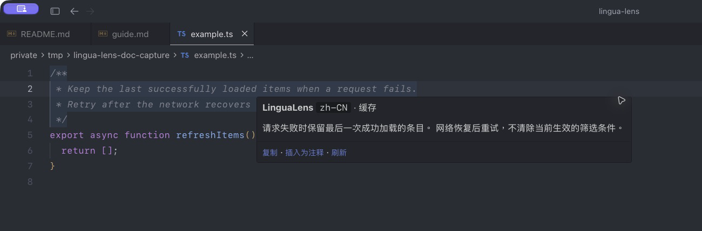
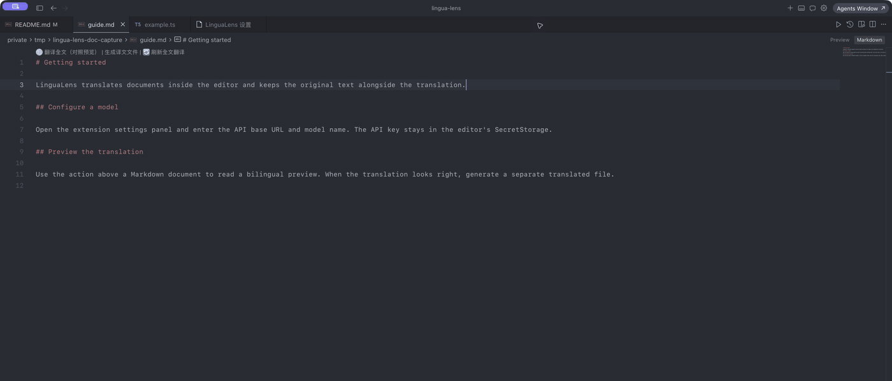

# LinguaLens

[English](README.md) | 简体中文

**在 VS Code / Cursor 内用自有的 OpenAI 兼容 LLM 翻译注释、字符串与文档，API Key 只进 SecretStorage，不会写入 settings.json。**

LinguaLens 适用于 **Visual Studio Code** 及兼容编辑器（**Cursor**、**Windsurf**、**VSCodium** 等）；市场显示名遵循微软品牌规范：**LinguaLens for Visual Studio Code**。

LinguaLens（扩展 ID：`samuelj1519.lingua-lens`）提供悬停翻译、选区与剪贴板工作流、全文预览与译文文件（Markdown/纯文本及 JSON、YAML、TOML、XML 等结构化文件）、配置文件悬停、Git 辅助、术语表、内存 LRU + 磁盘缓存以及设置 Webview。密钥按 API **origin** 存入 SecretStorage；只有你悬停或主动翻译的文本会发往所配置的端点。

## 在 Cursor 中查看效果

以下画面使用示例文本，翻译目标为简体中文（`zh-CN`）。



点击 Markdown 文档左上方的「翻译全文（对照预览）」按钮后，可在右侧查看原文与译文：



## 为什么选择它

| 能力 | 说明 |
| --- | --- |
| **悬停翻译** | tree-sitter（含正则回退）提取注释、字符串、Markdown 段落、配置值/键名、模板 UI 文本等；可选诊断、符号文档、Git 提交说明与选区块。 |
| **全文预览** | `lingualens:` 虚拟文档，支持交错或追加布局；按可译段落显示进度；可生成 `README.zh-CN.md` 等侧车文件。 |
| **编辑器工作流** | 选区、剪贴板/终端、替换/插入、弹窗翻译等快捷键；Markdown 顶部 CodeLens（翻译 / 刷新 / 生成译文）。 |
| **运维与隐私** | 分 origin 管理 API Key、测试连接、清缓存、工作区禁用、首次隐私确认、密钥检测与排除 glob。 |
| **国际化** | 扩展自绘 UI 跟随 `linguaLens.targetLanguage`（`l10n/bundle`）；内置设置页标签跟随编辑器界面语言（`package.nls`）。 |

## 快速开始

1. 安装 `.vsix`（仓库根目录 `npm run package`）或 `npm install && npm run build` 后按 **F5** 启动扩展开发宿主。
2. 在设置中配置 `linguaLens.llm.baseUrl` 与 `linguaLens.llm.model`（见下表）。
3. 执行 **LinguaLens: 设置 API Key** 与 **LinguaLens: 测试连接**。
4. 悬停注释，或在 `.md` 文件上执行 **翻译全文（对照预览）**。

分步教程：[快速开始](docs/zh-CN/tutorials/getting-started.md)。

## 提供商配置（OpenAI 兼容）

均使用 `POST {baseUrl}/chat/completions`，Bearer 令牌来自 **设置 API Key** 命令。

| 提供商 | 示例 `linguaLens.llm.baseUrl` | 说明 |
| --- | --- | --- |
| OpenAI | `https://api.openai.com/v1` | `package.json` 默认值。 |
| DeepSeek | `https://api.deepseek.com/v1` | 常需 `extraBody` 关闭思考模式。 |
| 通义千问（DashScope） | `https://dashscope.aliyuncs.com/compatible-mode/v1` | 兼容模式端点。 |
| 豆包 / 火山 Ark | `https://ark.cn-beijing.volces.com/api/v3` | 使用控制台提供的 OpenAI 兼容 base URL。 |

用户级 `settings.json` 示例：

```json
{
  "linguaLens.llm.baseUrl": "https://api.deepseek.com/v1",
  "linguaLens.llm.model": "deepseek-chat",
  "linguaLens.llm.extraBody": {
    "thinking": { "type": "disabled" }
  },
  "linguaLens.targetLanguage": "zh-CN"
}
```

更多细节与踩坑：[配置 LLM 提供商](docs/zh-CN/how-to/configure-providers.md)、[extraBody 与思考模式](docs/zh-CN/how-to/extra-body-thinking.md)。

## 常用设置

| 设置 | 默认值 | 作用 |
| --- | --- | --- |
| `linguaLens.enabled` | `true` | 按资源开关总启用。 |
| `linguaLens.targetLanguage` | `zh-CN` | 译文语言 + 扩展自绘 UI 语言。 |
| `linguaLens.llm.baseUrl` | `https://api.openai.com/v1` | API 根路径（按需包含 `/v1`）。 |
| `linguaLens.llm.model` | _(空)_ | 调用前必填。 |
| `linguaLens.llm.extraBody` | `{}` | 合并进聊天 JSON（思考开关等）。 |
| `linguaLens.hover.enabled` | `true` | 悬停翻译总开关。 |
| `linguaLens.document.forceTranslate` | `false` | 全文翻译跳过语言检测。 |
| `linguaLens.cache.enabled` | `true` | 内存 LRU + globalStorage 下 JSONL。 |

完整 52 项、七个设置分组：[设置参考](docs/zh-CN/reference/settings.md)（自动生成）。

## 常用命令（命令面板）

| 命令 | 默认快捷键 | 条件 |
| --- | --- | --- |
| `linguaLens.setApiKey` | — | 随时可用。 |
| `linguaLens.translateSelection` | `Ctrl+Alt+Shift+T` | 编辑器有选区。 |
| `linguaLens.translateDocument` | `Ctrl+Alt+Shift+D` | Markdown、纯文本及 JSON/YAML/TOML/XML 等结构化文件。 |
| `linguaLens.translateClipboardOrSelection` | `Ctrl+Alt+Shift+Y` | 终端选区或剪贴板。 |
| `linguaLens.openSettingsPanel` | — | QuickPick / 命令面板。 |
| `linguaLens.clearCache` | — | 命令面板 / 状态栏链接。 |

全部命令、CodeLens 与右键菜单：[命令参考](docs/zh-CN/reference/commands.md)。

## 常见问题

**悬停没有反应** — 检查 `linguaLens.enabled`、排除 glob、隐私确认，以及检测是否因已是目标语言而跳过。将 `linguaLens.log.level` 设为 `debug`，打开 **LinguaLens: 显示日志**。

**401 / 连接失败** — 确认 `baseUrl` 是否需带 `/v1`、模型 id 已填、Key 与 origin 一致。见 [排查连接错误](docs/zh-CN/how-to/troubleshoot-connection.md)。

**中文文档仍被翻译** — 关闭 `linguaLens.document.forceTranslate`；全文与悬停共用检测规则（除非强制）。

**更换模型后译文不对** — 缓存键含 `model`、`baseUrl` 与 `extraBody` 哈希；可悬停 **刷新** 或 **清除缓存**。见 [缓存说明](docs/zh-CN/explanation/caching.md)。

## 隐私与安全

- 悬停、选区或全文段落中的文本会发往 `linguaLens.llm.baseUrl`。
- API Key 不会出现在 `settings.json` 或设置面板 HTML 中（[CSP](docs/zh-CN/explanation/settings-panel-security.md)）。
- `.env`、密钥文件与自定义排除 glob 不会被读取翻译。
- 磁盘缓存位于扩展 globalStorage（`cache/v2`）。

[SECURITY.zh-CN.md](SECURITY.zh-CN.md) · [参与贡献](CONTRIBUTING.zh-CN.md)

## 文档导航

- [文档首页](docs/README.md)
- [教程](docs/zh-CN/tutorials/index.md) · [操作指南](docs/zh-CN/how-to/index.md) · [参考](docs/zh-CN/reference/index.md) · [说明](docs/zh-CN/explanation/index.md)

## 开发

```bash
npm install
npm run build
npm test
npm run package
```

`pretest` 会执行 `merge-config`、`merge-nls` 与 `generate-docs`。

## 许可证

MIT — 见 [LICENSE](LICENSE)。
