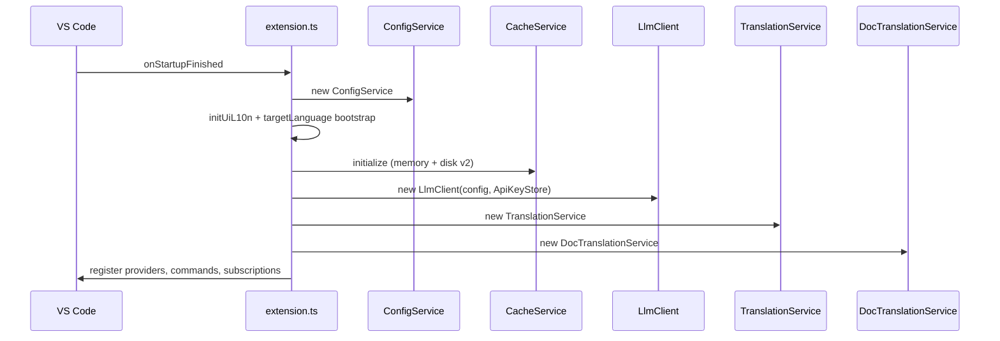
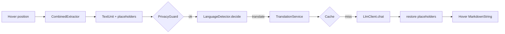
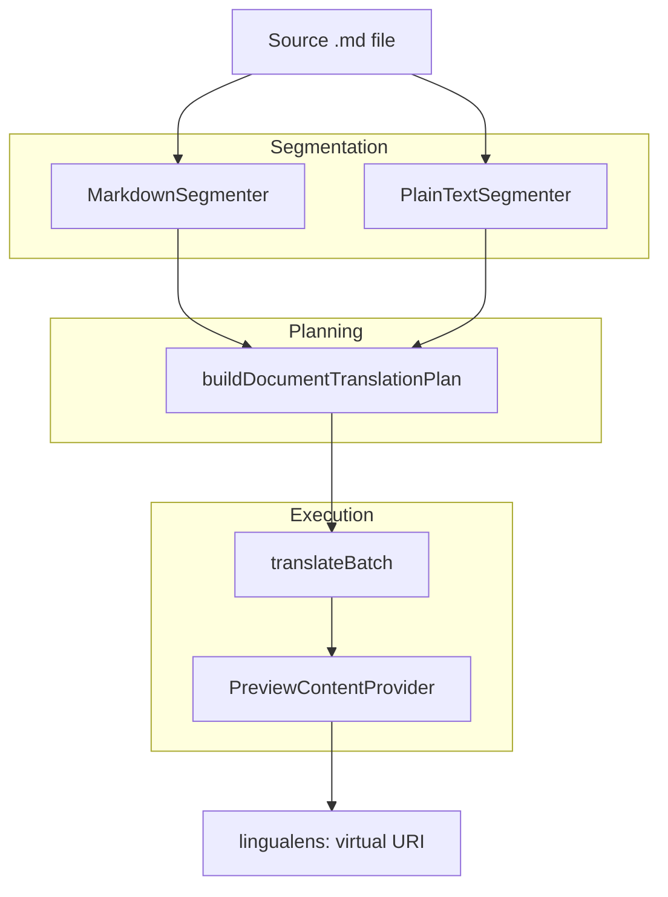

# Architecture

LinguaLens is a VS Code extension that connects editor events (hover, selection, documents, Git) to a shared **translation pipeline** backed by an OpenAI-compatible LLM, optional glossary, and two-tier cache. This page describes how components wire together at activation and runtime.

## Activation overview

`activate()` in `extension.ts` runs on `onStartupFinished`. High-level sequence:

### Core services

| Component | Responsibility |
|-----------|----------------|
| `ConfigService` | Merged `linguaLens.*` settings per resource URI |
| `ApiKeyStore` | Secrets keyed by `baseUrl` origin |
| `LlmClient` | HTTP chat completions, retries, semaphore, streaming |
| `CacheService` | SHA-256 keys, LRU memory, sharded JSONL disk |
| `TranslationService` | Cache, inflight dedupe, prompts, pause on failures |
| `GlossaryService` | Workspace JSON glossary → prompt terms |
| `PrivacyGuard` | Excludes paths, acknowledgment, secret heuristics |
| `ParserService` | tree-sitter WASM grammars for hover extraction |
| `CombinedExtractor` | Comments, strings, config keys, diagnostics, etc. |
| `DocTranslationService` | Segment, plan, batch translate, preview session |
| `SettingsPanelController` | Webview settings UI (no API key in HTML) |
| `StatusBarController` | Enabled state, language picker, key indicator |

## Data flow: hover translation

Hover providers attach actions through `HoverActionRegistry` (copy, replace, insert comment, retranslate). Trusted command links use VS Code 1.85+ whitelist (decision D6).

## Data flow: document translation

Sessions (`DocSession`) hold segments, per-segment results, cancellation, and link preview URI to source URI. `DocumentAssembler` walks segments in source order for interleaved/append rendering.

## Parsing layer

- WASM files copied to `dist/wasm/` from `tree-sitter-wasms` (D4).
- `ParserService` loads grammars per `LANGUAGE_SPECS` in `specs.ts`.
- Incremental edits: dirty flag then full re-parse for affected URI (D5).
- Config file hovers use `configLanguages.ts` to detect YAML/TOML/JSON/etc.

JSX text nodes are not translated by default (D9).

## LLM layer

`LlmClient`:

- Builds POST to `chat/completions`.
- Merges `llm.extraBody`, `temperature`, optional `response_format` for JSON batches.
- `RequestSemaphore` separates interactive vs background priority.
- `testConnection()` for health checks from command and settings panel.

API keys never pass through the settings panel webview; only `ApiKeyStore` in the extension host.

## Caching layer

Keys hash: text, targetLang, model, promptVersion, baseUrl, extraBodyHash (supersedes older decision D7 — see [Decisions](./decisions.md)). See [Caching](./caching.md).

## UI surfaces

| Surface | Mechanism |
|---------|-----------|
| Document preview | `TextDocumentContentProvider` scheme `lingualens:` (D10) |
| Long selection output | Virtual Markdown document in side column (D11) |
| Settings panel | Webview + CSP nonce (`panelHtml.ts`) |
| Status bar | Target language, toggle, connection hint |
| CodeLens | Document translate shortcuts |

## Localization

`l10n/` bundle + `uiL10n.ts`; target language change resets cache and refreshes previews. Bootstrap aligns unset target with UI locale once (`targetLanguageBootstrap.ts`).

## Deactivation

`deactivate()` flushes disk cache and disposes `ParserService`.

## Extension capabilities

From `package.json`:

- **Untrusted workspaces:** limited — glossary path and skip patterns restricted.
- **Virtual workspaces:** hover/selection only; document features limited.

## Integration test hook

`LINGUALENS_INTEGRATION_TEST=1` rewrites `llm.baseUrl` to local mock server and sets API key for CI.

## Related documentation

- [Detection](./detection.md)
- [Segmentation](./segmentation.md)
- [Caching](./caching.md)
- [Settings panel security](./settings-panel-security.md)
- [Decisions](./decisions.md)
