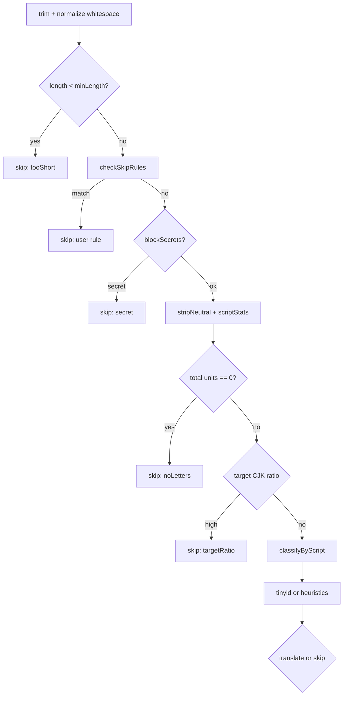

# Language detection

Before calling the LLM, AI Translate decides whether a text unit should be translated. The core function is `decide()` in `LanguageDetector.ts`, used by hover extraction and document segment planning (`shouldTranslateDocumentText`).

## Design goals

- Avoid translating text that is already in the **target language family** (save cost, reduce noise).
- Skip unsuitable text: too short, no letters, user patterns, secrets.
- Remain fast and local — no network for detection.
- Degrade gracefully on ambiguous short Latin strings.

## Configuration inputs

`DetectOptions` mirrors settings:

| Setting | Field | Default |
|---------|-------|---------|
| `aiTranslate.targetLanguage` | `target` | `zh-CN` |
| `aiTranslate.detection.minLength` | `minLength` | 3 |
| `aiTranslate.detection.targetRatio` | `targetRatio` | 0.6 |
| `aiTranslate.detection.reliableMinLength` | `reliableMinLength` | 20 |
| `aiTranslate.detection.skipPatterns` | `userSkipPatterns` | `[]` |
| `aiTranslate.privacy.blockSecrets` | `blockSecrets` | true |
| `aiTranslate.detection.strictChineseVariant` | `strictChineseVariant` | false |

### strictChineseVariant (important)

The setting **`aiTranslate.detection.strictChineseVariant`** is exposed in configuration for future use: distinguishing simplified vs traditional Chinese when deciding skip vs translate.

**Current implementation:** `decide()` accepts `strictChineseVariant` in `DetectOptions` but **does not implement variant split**. Simplified and traditional both map to the `zh` family via `familyOf()`. Practical implications:

- Target `zh-CN` skips most Han text as already Chinese.
- Target `zh-TW` behaves the same for script statistics — not ideal for zh-CN→zh-TW conversion.
- Use `aiTranslate.document.forceTranslate` for document workflows until variant logic lands.

This aligns with engineering decision D8 (simplified/traditional treated as one family for skip logic).

## Pipeline stages

### Skip rules

`checkSkipRules` applies user regexes from `skipPatterns` and built-in patterns (URLs, numeric-heavy lines, etc. — see `SkipRules.ts`).

### Script classification

`scriptStats` counts Han, kana, hangul, Latin words, Cyrillic words, etc.

`classifyByScript`:

- Hangul share → `ko`
- Kana present → `ja`
- Han ≥ 50% of CJK units → `zh`
- Cyrillic vs Latin word counts → `cyrillic` or `latin`
- Else `unknown`

### Latin and Cyrillic disambiguation

For `latin` or `cyrillic` scripts:

- If letter count ≥ `reliableMinLength`, call **tinyld** (`defaultLangBackend`) with candidate families (`en`, `fr`, `de`, `es` or `ru`).
- Else use `shortTextHeuristic` (stopwords, diacritics).

Decision D3: tinyld only in this narrow path, not for every hover.

### Target family comparison

`familyOf(target)` maps `zh-CN` / `zh-TW` → `zh`.

Skip when:

- Detected family equals target family (`sameFamily`).
- CJK target and script ratio ≥ `targetRatio` (`targetRatio` reason).
- Special case: target `ja`, detected `zh`, few Han characters (`unreliableShort`).

### Unknown detection

`decideUnknownShort` balances translate vs skip for short ambiguous text differently per target family (e.g. Latin words with CJK target → often translate; Latin-only with English target → often skip as unreliable).

## Outputs

`Decision` type:

- `action: 'skip' | 'translate'`
- `reason` when skipped (for logging/debug)
- `detected` language family when known
- `confidence` when translating

Hover code does not show reason to users by default; enable debug logging to inspect.

## Document vs hover

Same `decide()` logic feeds document plans unless `document.forceTranslate` overrides skip decisions in the document planner. Selection commands **bypass** automatic skip (user explicitly requests translation) but still run privacy checks.

## Tuning guide

| Need | Adjustment |
|------|------------|
| More hover on short strings | Lower `minLength` (careful: noise↑) |
| Less skip on mixed Chinese/English | Lower `targetRatio` or force document |
| Skip identifiers | Add `skipPatterns` regex |
| Never send API keys in comments | Keep `blockSecrets` true |

## Related documentation

- [Force translate](../how-to/force-translate.md)
- [Segmentation](./segmentation.md)
- [Locales](../reference/locales.md)
