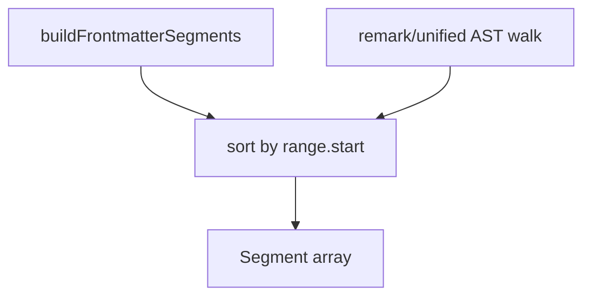

# Document segmentation

Markdown and plain-text document translation does not send the whole file as one prompt. The extension splits the source into **segments** with stable byte offsets, translates only eligible units, and reassembles output for preview and side files.

## Segment model

Each `Segment` has:

- `id` — stable string for batch JSON ids (`s0`, `s1`, …).
- `kind` — discriminant driving preservation and prompts.
- `range` — `{ start, end }` offsets in UTF-16/source string coordinates.
- `sourceText` — slice for hashing and LLM input.

Common kinds from `MarkdownSegmenter`:

| Kind | Typical treatment |
|------|-------------------|
| `preserved` | Code fences, raw HTML blocks, delimiters — not sent |
| `paragraph` | Prose paragraphs — batch translate |
| `heading` | Heading line text — batch |
| `list` | List container; may use `list-lines` fallback |
| `blockquote` | Quoted blocks |
| `table` | Table containers |
| `frontmatter` | YAML/TOML field values per config |
| `code` | Inline or fenced code — usually preserved |

Plain text uses `PlainTextSegmenter`: blank-line separated paragraphs only.

## Markdown pipeline

1. **Frontmatter** — `frontmatterSegments.ts` parses the leading block; configured keys become translatable value ranges.
2. **Body** — `MarkdownSegmenter` walks markdown structure (headings, lists, tables, blockquotes, paragraphs).
3. **Preservation** — Fenced code, thematic breaks, and structural markers become `preserved` so the LLM does not alter syntax.

Configuration passed into segmentation:

- `targetLanguage`, `detection`, `privacy`, `markdown.frontmatterFields` from workspace config.

## Planning translation

`buildDocumentTranslationPlan` maps each segment to a `DocumentSegmentPlan`:

| Mode | Meaning |
|------|---------|
| `skip` | Detection or empty — no API call |
| `batch` | Included in `translateBatch` JSON request |
| `list-lines` | List split into per-line items (`listFallback.ts`) when container batch fails validation |

`shouldTranslateDocumentText` runs detection on stripped text (`stripMarkdownForDetection` per kind).

`validateAndFallbackContainers` post-processes container segments after batch results.

## Batch execution

`DocTranslationService.runTranslation`:

1. Peek disk/memory cache per segment (`peekDocumentBatchCache`).
2. Build pending items with placeholders for inline code/links if extracted.
3. `translateBatch` groups by `document.batchSize` and `maxBatchChars`.
4. Frontmatter items use `batchCacheKind: 'documentFrontmatterBatch'`.
5. Update `session.results` and refresh preview provider.

Progress: `DocumentSegmentProgressReporter` + `countCompletedTranslatableSegments`.

## Assembly

`DocumentAssembler` / `BilingualRenderer`:

- Walk segments sorted by `range.start`.
- For `interleaved` preview style, insert translation blocks adjacent to source blocks.
- For `append`, collect translations after each block.
- Side files use `renderTranslated` or `renderBilingual`.

No offset-based splicing on the original file until the user saves a side file or manually edits.

## Hover document segments

`DocumentSegmentLocator` reuses segmenters for hover on markdown/plaintext when `hover.documents` is enabled. Offset at cursor maps to segment kind for appropriate hover title and extraction.

## Limits

- Very large files: full `getText()` in memory for document path.
- Tree-sitter `maxFileSizeKB` applies to **code** hovers, not markdown segmenter.
- List/table complexity may trigger line-level fallback rather than one-shot container translation.

## Placeholders inside segments

Inline code spans, links, and other fragile Markdown inline elements may be replaced with placeholders before the LLM sees text (`Placeholder` types in parsing). After translation, `restore()` merges placeholders back. If restoration fails (`placeholderOk: false`), preview may show sentinel markers — refresh after fixing source Markdown or clear cache if a bad model output was stored.

## Related documentation

- [Translate Markdown](../how-to/translate-markdown.md)
- [Frontmatter](../how-to/frontmatter.md)
- [Detection](./detection.md)
- [Architecture](./architecture.md)
