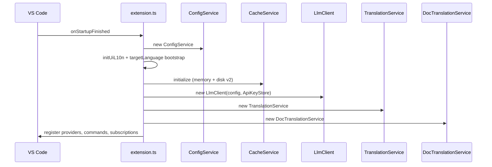
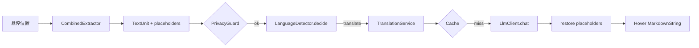
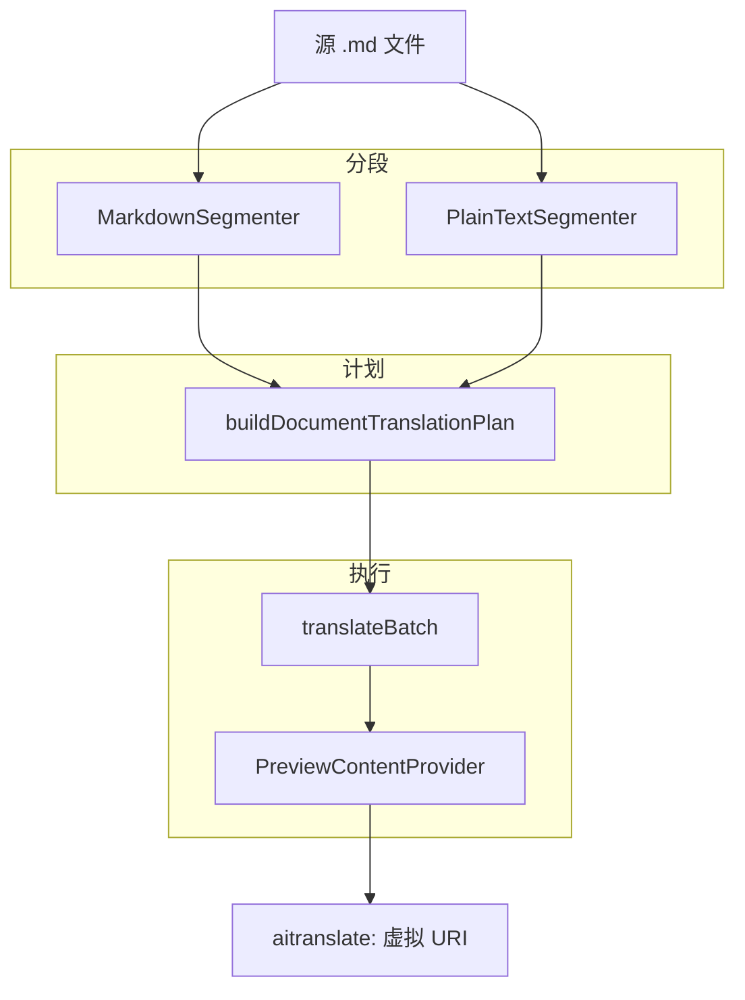

# 架构

LinguaLens 是一款 VS Code 扩展，将编辑器事件（悬停、选区、文档、Git）连接到共享的**翻译流水线**，后端为 OpenAI 兼容的 LLM，并可选术语表与双层缓存。本文说明组件在激活与运行时的衔接方式。

## 激活概览

`extension.ts` 中的 `activate()` 在 `onStartupFinished` 时运行。高层顺序如下：

### 核心服务

| 组件 | 职责 |
|------|------|
| `ConfigService` | 按资源 URI 合并 `aiTranslate.*` 设置 |
| `ApiKeyStore` | 按 `baseUrl` 源（origin）存储密钥 |
| `LlmClient` | HTTP chat completions、重试、信号量、流式 |
| `CacheService` | SHA-256 键、LRU 内存、分片 JSONL 磁盘 |
| `TranslationService` | 缓存、进行中去重、提示词、失败暂停 |
| `GlossaryService` | 工作区 JSON 术语表 → 提示词术语 |
| `PrivacyGuard` | 路径排除、确认、密钥启发式 |
| `ParserService` | tree-sitter WASM 语法，用于悬停提取 |
| `CombinedExtractor` | 注释、字符串、配置键、诊断信息等 |
| `DocTranslationService` | 分段、计划、批量翻译、预览会话 |
| `SettingsPanelController` | Webview 设置 UI（HTML 中不含 API 密钥） |
| `StatusBarController` | 启用状态、语言选择器、密钥指示 |

## 数据流：悬停翻译

悬停提供方通过 `HoverActionRegistry` 附加操作（复制、替换、插入注释、重新翻译）。受信任的命令链接使用 VS Code 1.85+ 白名单（决策 D6）。

## 数据流：文档翻译

会话（`DocSession`）保存分段、每段结果、取消状态，并将预览 URI 链接到源 URI。`DocumentAssembler` 按源顺序遍历分段，用于交错/追加式渲染。

## 解析层

- WASM 文件从 `tree-sitter-wasms` 复制到 `dist/wasm/`（D4）。
- `ParserService` 按 `specs.ts` 中的 `LANGUAGE_SPECS` 加载语法。
- 增量编辑：脏标记后对受影响 URI 全量重新解析（D5）。
- 配置文件悬停通过 `configLanguages.ts` 检测 YAML/TOML/JSON 等。

JSX 文本节点默认不翻译（D9）。

## LLM 层

`LlmClient`：

- 构建对 `chat/completions` 的 POST。
- 合并 `llm.extraBody`、`temperature`，JSON 批量时可选 `response_format`。
- `RequestSemaphore` 区分交互与后台优先级。
- `testConnection()` 供命令与设置面板做健康检查。

API 密钥从不经过设置面板 webview；仅扩展宿主中的 `ApiKeyStore` 处理。

## 缓存层

键哈希包含：text、targetLang、model、promptVersion、baseUrl、extraBodyHash（取代较早的决策 D7——见[决策记录](decisions.md)）。详见[缓存](caching.md)。

## UI 表面

| 表面 | 机制 |
|------|------|
| 文档预览 | `TextDocumentContentProvider`，scheme `aitranslate:`（D10） |
| 长选区输出 | 侧栏虚拟 Markdown 文档（D11） |
| 设置面板 | Webview + CSP nonce（`panelHtml.ts`） |
| 状态栏 | 目标语言、开关、连接提示 |
| CodeLens | 文档翻译快捷入口 |

## 本地化

`l10n/` 包 + `uiL10n.ts`；目标语言变更会重置缓存并刷新预览。引导逻辑在目标未设置时一次性与 UI 区域设置对齐（`targetLanguageBootstrap.ts`）。

## 停用

`deactivate()` 刷新磁盘缓存并释放 `ParserService`。

## 扩展能力

来自 `package.json`：

- **不受信任的工作区：** 受限——术语表路径与跳过模式受限。
- **虚拟工作区：** 仅悬停/选区；文档功能受限。

## 集成测试钩子

`AITRANSLATE_INTEGRATION_TEST=1` 将 `llm.baseUrl` 重写为本地 mock 服务器并为 CI 设置 API 密钥。

## 命令与贡献点

`package.json` 声明的命令经 `registerCommands` 绑定到 `TranslationService`、`DocTranslationService` 与 Git/SCM 辅助模块。菜单 `when` 子句限制文档命令仅对 markdown/plaintext 与特定 scheme 可见，避免在虚拟预览或不受支持语言上显示无效入口。CodeLens 与标题栏按钮复用同一命令 id，保证键绑定与 UI 入口行为一致。

## 配置热更新

`ConfigService` 监听 `onDidChangeConfiguration`，过滤 `aiTranslate` 前缀。`targetLanguage`、`cache.*`、`llm.model` 等变更会触发缓存 `configure()`、预览刷新、状态栏与 UI l10n 重置。`llm.baseUrl` 变更不自动迁移 SecretStorage 密钥——用户须对新源运行 **Set API Key**，这与按 origin 存储的设计一致。

## 相关文档

- [语言检测](detection.md)
- [文档分段](segmentation.md)
- [缓存](caching.md)
- [设置面板安全](settings-panel-security.md)
- [架构决策记录](decisions.md)
