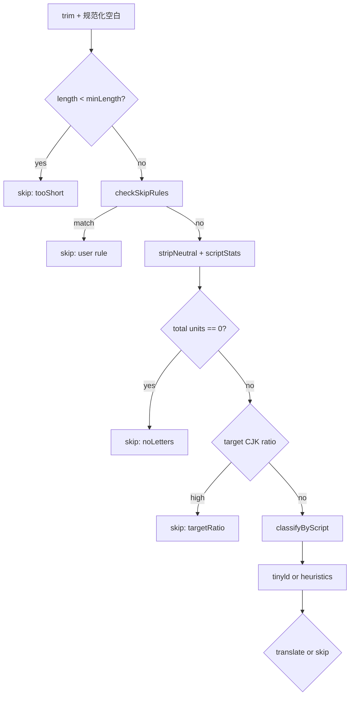

# 语言检测

在调用 LLM 之前，LinguaLens 会判断文本单元是否应被翻译。核心函数为 `LanguageDetector.ts` 中的 `decide()`，用于悬停提取与文档分段计划（`shouldTranslateDocumentText`）。

## 设计目标

- 避免翻译已属于**目标语族**的文本（节省成本、减少噪音）。
- 跳过不适用的文本：过短、无字母、用户模式。
- 保持快速且本地——检测不发起网络请求。
- 对模糊的短拉丁字符串优雅降级。

## 配置输入

`DetectOptions` 与设置项对应：

| 设置 | 字段 | 默认值 |
|------|------|--------|
| `linguaLens.targetLanguage` | `target` | `zh-CN` |
| `linguaLens.detection.minLength` | `minLength` | 3 |
| `linguaLens.detection.targetRatio` | `targetRatio` | 0.6 |
| `linguaLens.detection.reliableMinLength` | `reliableMinLength` | 20 |
| `linguaLens.detection.skipPatterns` | `userSkipPatterns` | `[]` |
| `linguaLens.detection.strictChineseVariant` | `strictChineseVariant` | false |

### strictChineseVariant（重要）

设置项 **`linguaLens.detection.strictChineseVariant`** 已暴露，供将来在跳过与翻译之间区分简体与繁体中文。

**当前实现：** `decide()` 在 `DetectOptions` 中接受 `strictChineseVariant`，但**未实现变体拆分**。简体与繁体均通过 `familyOf()` 映射到 `zh` 语族。实际影响：

- 目标 `zh-CN` 时，多数汉字文本会因已是中文而被跳过。
- 目标 `zh-TW` 时脚本统计行为相同——不适合 zh-CN→zh-TW 转换场景。
- 在变体逻辑落地前，文档工作流请使用 `linguaLens.document.forceTranslate`。

这与工程决策 D8（简繁在跳过逻辑中视为同一语族）一致。

## 流水线阶段

### 跳过规则

`checkSkipRules` 应用用户来自 `skipPatterns` 的正则及内置模式（URL、数字占比高的行等——见 `SkipRules.ts`）。

### 脚本分类

`scriptStats` 统计汉字、假名、韩文、拉丁词、西里尔词等。

`classifyByScript`：

- 韩文占比高 → `ko`
- 存在假名 → `ja`
- 汉字占 CJK 单位 ≥ 50% → `zh`
- 西里尔与拉丁词数 → `cyrillic` 或 `latin`
- 否则 `unknown`

### 拉丁与西里尔消歧

对 `latin` 或 `cyrillic` 脚本：

- 若字母数 ≥ `reliableMinLength`，调用 **tinyld**（`defaultLangBackend`），候选语族为（`en`、`fr`、`de`、`es` 或 `ru`）。
- 否则使用 `shortTextHeuristic`（停用词、变音符号）。

决策 D3：tinyld 仅在此窄路径使用，而非每次悬停都调用。

### 目标语族比较

`familyOf(target)` 将 `zh-CN` / `zh-TW` → `zh`。

在以下情况跳过：

- 检测语族等于目标语族（`sameFamily`）。
- CJK 目标且脚本占比 ≥ `targetRatio`（`targetRatio` 原因）。
- 特例：目标 `ja`，检测为 `zh`，汉字很少（`unreliableShort`）。

### 未知检测

`decideUnknownShort` 对短模糊文本按目标语族不同地权衡翻译与跳过（例如 CJK 目标下的拉丁词常翻译；仅拉丁且英语目标常因不可靠而跳过）。

## 输出

`Decision` 类型：

- `action: 'skip' | 'translate'`
- 跳过时带 `reason`（供日志/调试）
- 已知时带 `detected` 语族
- 翻译时带 `confidence`

悬停代码默认不向用户展示 reason；开启调试日志可查看。

## 文档与悬停

同一 `decide()` 逻辑用于文档计划，除非 `document.forceTranslate` 在文档计划器中覆盖跳过决策。选区命令**绕过**自动跳过（用户显式请求翻译）。路径排除与隐私确认仍由 `PrivacyGuard` 处理。

## 调优指南

| 需求 | 调整 |
|------|------|
| 更多短字符串悬停 | 降低 `minLength`（注意：噪音↑） |
| 中英混合时少跳过 | 降低 `targetRatio` 或强制文档翻译 |
| 跳过标识符 | 添加 `skipPatterns` 正则 |

## API 密钥与日志

LinguaLens **不会**扫描文档正文以猜测凭据。请通过 **Set API Key** 将密钥存入 SecretStorage。面向用户的错误与输出通道日志经 `redactSecrets` 处理，若服务端错误文本中出现已存密钥、`Bearer`/`Authorization` 或常见 `key=value` 模式，会替换为 `***`。

## 日志与调试

在 `linguaLens.log.level` 为 `debug` 时，`LanguageDetector` 可将 `reason`（如 `tooShort`、`targetRatio`、`sameFamily`）写入输出通道，帮助判断「为何未翻译」。悬停 UI 默认不展示原因，以免干扰阅读。文档计划器在跳过段时同样记录 reason，可与分段 id 关联。若误判频繁，建议先调整 `skipPatterns` 与 `targetRatio`，再考虑 `forceTranslate`，以免对所有段落无差别调用 API。

## 与术语表、占位符的边界

检测在占位符提取之后对「可见文本」运行；因此 `{{PH0}}` 类占位不会干扰脚本统计。术语表不改变 `decide()` 结果，仅影响翻译提示词。选区命令在多数情况下将 `action` 视为显式 `translate`，路径排除与隐私确认仍适用。

## 测试与回归建议

修改 `LanguageDetector` 时，应覆盖短拉丁串、纯数字、URL、CJK 混合与 `skipPatterns` 命中用例。`reliableMinLength` 边界（19 vs 20 字符）对 tinyld 分支敏感。文档计划与悬停共用 `decide()`，单测失败可能同时影响两种 UI 路径。

## 用户可配置反模式

将 `minLength` 设为 1 会导致大量标识符与单字母变量触发翻译；将 `targetRatio` 设为 0 几乎禁用 CJK 跳过，成本激增。`skipPatterns` 错误正则可能抛错或永不匹配——在设置 JSON 中验证正则合法性。对文档分段，检测在 `stripMarkdownForDetection` 之后运行，因此 Markdown 标记符号不计入脚本比例；纯英文段落即使用目标 `zh-CN` 也会翻译，除非整段被用户 `skipPatterns` 排除。悬停与文档共用本逻辑是刻意设计，避免两套规则让用户困惑。

## 相关文档

- [强制翻译](../how-to/force-translate.md)
- [文档分段](segmentation.md)
- [区域与目标语言](../reference/locales.md)
