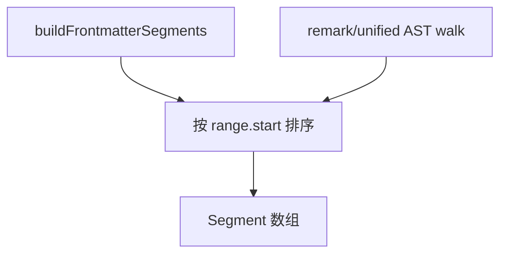

# 文档分段

Markdown 与纯文本文档翻译不会将整文件作为一条提示发送。扩展将源文件拆分为带稳定字节偏移的**分段**，仅翻译符合条件的单元，并重组输出供预览与旁路文件使用。

## 分段模型

每个 `Segment` 包含：

- `id` — 批量 JSON id 的稳定字符串（`s0`、`s1`、…）。
- `kind` — 决定保留策略与提示词的类型标记。
- `range` — `{ start, end }`，UTF-16/源字符串坐标中的偏移。
- `sourceText` — 用于哈希与 LLM 输入的切片。

`MarkdownSegmenter` 常见 kind：

| Kind | 典型处理 |
|------|----------|
| `preserved` | 代码围栏、原始 HTML 块、分隔符——不发送 |
| `paragraph` | 正文段落——批量翻译 |
| `heading` | 标题行文本——批量 |
| `list` | 列表容器；可能使用 `list-lines` 回退 |
| `blockquote` | 引用块 |
| `table` | 表格容器 |
| `frontmatter` | 按配置的 YAML/TOML 字段值 |
| `code` | 行内或围栏代码——通常保留 |

纯文本使用 `PlainTextSegmenter`：仅按空行分隔的段落。

## Markdown 流水线

1. **Frontmatter** — `frontmatterSegments.ts` 解析文首块；配置的键成为可翻译的值范围。
2. **正文** — `MarkdownSegmenter` 遍历 Markdown 结构（标题、列表、表格、引用、段落）。
3. **保留** — 围栏代码、主题分隔线与结构标记变为 `preserved`，避免 LLM 改动语法。

传入分段的配置：

- 工作区配置中的 `targetLanguage`、`detection`、`privacy`、`markdown.frontmatterFields`。

## 翻译计划

`buildDocumentTranslationPlan` 将每段映射为 `DocumentSegmentPlan`：

| 模式 | 含义 |
|------|------|
| `skip` | 检测为空或不翻译——无 API 调用 |
| `batch` | 纳入 `translateBatch` JSON 请求 |
| `list-lines` | 容器批量校验失败时按行拆分（`listFallback.ts`） |

`shouldTranslateDocumentText` 对剥离后的文本运行检测（按 kind 使用 `stripMarkdownForDetection`）。

`validateAndFallbackContainers` 在批量结果后对容器分段做后处理。

## 批量执行

`DocTranslationService.runTranslation`：

1. 按段窥视磁盘/内存缓存（`peekDocumentBatchCache`）。
2. 构建待处理项，若提取了行内代码/链接则使用占位符。
3. `translateBatch` 按 `document.batchSize` 与 `maxBatchChars` 分组。
4. Frontmatter 项使用 `batchCacheKind: 'documentFrontmatterBatch'`。
5. 更新 `session.results` 并刷新预览提供方。

进度：`DocumentSegmentProgressReporter` + `countCompletedTranslatableSegments`。

## 组装

`DocumentAssembler` / `BilingualRenderer`：

- 按 `range.start` 排序遍历分段。
- `interleaved` 预览样式在源块旁插入译文块。
- `append` 在每块后收集译文。
- 旁路文件使用 `renderTranslated` 或 `renderBilingual`。

在用户保存旁路文件或手动编辑之前，不会对原文件做基于偏移的拼接。

## 悬停文档分段

启用 `hover.documents` 时，`DocumentSegmentLocator` 在 markdown/plaintext 上复用分段器。光标偏移映射到分段 kind，以决定悬停标题与提取方式。

## 限制

- 超大文件：文档路径在内存中 `getText()` 全量加载。
- Tree-sitter 的 `maxFileSizeKB` 适用于**代码**悬停，不适用于 markdown 分段器。
- 列表/表格复杂时可能触发行级回退，而非一次性翻译整个容器。

## 分段内占位符

行内代码、链接等脆弱的 Markdown 行内元素可能在 LLM 看到文本前被替换为占位符（解析中的 `Placeholder` 类型）。翻译后 `restore()` 合并占位符。若恢复失败（`placeholderOk: false`），预览可能显示哨兵标记——修复源 Markdown 后刷新，或若错误模型输出已缓存则清空缓存。

## 取消与错误恢复

`DocSession` 持有 `CancellationToken`；用户关闭预览或运行新翻译任务时可取消进行中的批量请求。某批 JSON 解析失败时，扩展可能将容器分段降级为 `list-lines` 或保留源文本并在预览中标记失败段，而不是静默丢弃整篇文档。日志中的 `segmentId` 与 `s0`、`s1` 等 id 对应，便于对照源文件偏移调试。

## 与 side file 的关系

旁路文件生成走 `DocumentAssembler` 的 `renderTranslated` / `renderBilingual` 路径，与预览相同分段顺序，但不写入 `aitranslate:` 虚拟 URI。若用户在预览仍进行翻译时生成 side file，扩展会等待当前会话 `results` 达到可组装状态或提示进度未完成。`sideFileContent` 为 `bilingual` 时，交错规则与 `previewStyle: interleaved` 类似，但输出为持久文件而非只读编辑器。

## remark 遍历与结构保留

`MarkdownSegmenter` 基于 unified/remark AST 遍历，识别标题层级、列表嵌套与表格单元格边界。复杂 GFM（任务列表、脚注）可能部分落入 `preserved` 或段落批量，行为以实现为准。升级 remark 依赖时应在 ADR 或变更说明中记录分段差异，避免用户预览布局突变。纯文本分段器不解析 Markdown 语法，仅按空行切分，适合 release notes 类无结构文本。

## 性能特征

分段在打开预览时同步完成，极大文件会阻塞 UI 短暂时间；翻译本身异步。`maxBatchChars` 防止单批提示超过模型上下文；与 `batchSize` 共同限制并发请求大小。列表 `list-lines` 回退会增加请求次数但提高正确率，是延迟与质量权衡。

## 与 hover.documents 的共享

`DocumentSegmentLocator` 对 markdown/plaintext 复用同一分段数组，保证光标悬停看到的段落边界与批量翻译一致。若分段算法升级导致边界变化，悬停标题与预览可能短暂不一致直至重新打开预览。`stripMarkdownForDetection` 按 kind 剥离标记，列表项与段落检测行为不同，计划器可能跳过列表容器而翻译内部行。

## UTF-16 偏移注意

`range` 使用与 VS Code 文档一致的 UTF-16 代码单元偏移，含代理对字符的字符串切片需与 `document.getText(range)` 一致。罕见 emoji 或组合字符边界错误会导致占位符恢复失败；修复源文件或避免在围栏边界拆分 surrogate。表格单元格内多段落可能合并为单个 `table` 容器批量；若模型破坏列对齐，可尝试缩小表格或手工拆分为多个小文件再翻译，列表 `list-lines` 回退是类似的质量兜底策略。`DocumentSegmentProgressReporter` 对用户可见的进度基于可译段计数，preserved 段不计入 API 进度；若进度条很快满但预览仍空白，检查是否全部 skip 或 force 未开。plain text 分段不识别 `#` 标题，需要结构时请用 `.md` 扩展名或 markdown 语言模式。

## 相关文档

- [翻译 Markdown](../how-to/translate-markdown.md)
- [Frontmatter](../how-to/frontmatter.md)
- [语言检测](detection.md)
- [架构](architecture.md)
